<div align="center">

# 🎮 PokéTrade - Advanced Trading Platform

### *Experience the Future of Trading with Pokémon Cards Powered by Real-Time Market Data & AI*

[](https://poketrade28.vercel.app/)
[](https://drive.google.com/file/d/1-35L4hrt-33Ljl2ObmGUgwkYgobIhl1Y/view?usp=sharing)
[](https://opensource.org/licenses/MIT)

</div>

---

## 📋 Table of Contents

- [🎯 Overview](#-overview)
- [🏗️ Architecture](#️-architecture)
- [✨ Features](#-features)
- [🛠️ Tech Stack](#️-tech-stack)
- [⚡ Quick Start](#-quick-start)
- [🔧 Configuration](#-configuration)
- [🎮 Usage Guide](#-usage-guide)
- [🌐 API Endpoints](#-api-endpoints)
- [🤝 Contributing](#-contributing)
- [📄 License](#-license)
- [🔗 Links](#-links)

---

## 🎯 Overview

**PokéTrade** is a revolutionary trading platform that bridges the gap between traditional financial markets and collectible card gaming. By mapping iconic Pokémon cards to real stock market data, we create an innovative trading experience powered by cutting-edge AI technology.

### 🎪 **What Makes PokéTrade Special?**

- **🔄 Real-Time Market Integration**: Live stock data from FinnHub API mapped to Pokémon cards
- **🤖 AI-Powered Analysis**: Google Gemini AI provides intelligent trading insights
- **🎙️ Voice Trading**: Advanced speech recognition for hands-free trading
- **🌍 Multi-Language Support**: Native support for English, Hindi, and Telugu
- **📊 Advanced Analytics**: Professional-grade market heatmaps and charts
- **🎨 Modern UI/UX**: Beautiful, responsive design with dark/light themes

---

## 🏗️ Architecture

### 📐 **System Architecture Diagram**



```mermaid
graph TB
    subgraph "Frontend Layer"
        A[React/Next.js App] --> B[Theme Provider]
        A --> C[Language Provider]
        A --> D[UI Components]
        D --> E[Radix UI Components]
        D --> F[Custom Components]
        F --> G[Market Heatmap]
        F --> H[Trading Chatbot]
        F --> I[Portfolio Manager]
        F --> J[AI Insights]
    end
    
    subgraph "API Layer"
        K[Next.js API Routes] --> L[Translation API]
        K --> M[Symbol Extraction API]
        L --> N[Google Gemini AI]
        M --> N
    end
    
    subgraph "Services Layer"
        O[Market API Service] --> P[FinnHub API]
        Q[Gemini Service] --> N
        R[Speech Service] --> S[Web Speech API]
        T[Pokemon API] --> U[PokeAPI]
    end
    
    subgraph "Data Layer"
        V[Real-time Stock Data] --> P
        W[Pokemon Card Data] --> U
        X[AI Analysis] --> N
        Y[Market Insights] --> P
    end
    
    subgraph "External APIs"
        P[FinnHub Stock API]
        N[Google Gemini AI]
        U[Pokemon API]
        Z[Web Speech API]
    end
    
    A --> K
    A --> O
    A --> Q
    A --> R
    O --> V
    T --> W
    Q --> X
    O --> Y
    R --> Z
    
    style A fill:#e1f5fe
    style N fill:#f3e5f5
    style P fill:#e8f5e8
    style U fill:#fff3e0
```

### 🔧 **Core Architecture Components**

#### **Frontend Layer (React/Next.js 15)**
- **🎨 UI Framework**: Next.js 15 with App Router
- **⚡ State Management**: React Context API with TypeScript
- **🎪 Component Library**: Radix UI + Custom Components
- **🌊 Styling**: Tailwind CSS with custom design system
- **🌐 Internationalization**: Multi-language support with AI translation

#### **API Layer (Next.js API Routes)**
- **🔄 Translation Service**: Real-time AI translation using Gemini
- **🔍 Symbol Extraction**: Intelligent stock symbol parsing
- **📊 Market Data**: Real-time financial data integration
- **🤖 AI Chat**: Conversational AI for trading assistance

#### **Services Layer**
- **📈 Market Service**: FinnHub API integration for real-time data
- **🧠 AI Service**: Google Gemini AI for analysis and chat
- **🎙️ Speech Service**: Web Speech API for voice interactions
- **🎮 Pokemon Service**: PokeAPI for card data and metadata

#### **Data Integration**
- **💹 Stock Market**: Real-time price feeds from FinnHub
- **🎯 Pokemon Cards**: Comprehensive card database from PokeAPI
- **🤖 AI Insights**: Dynamic market analysis and predictions
- **📊 Analytics**: Performance tracking and portfolio management

---

## ✨ Features

### 🎯 **Core Trading Features**

#### **💹 Real-Time Market Data**
- Live stock prices mapped to Pokémon cards
- Professional market heatmaps with gain/loss visualization
- Real-time ticker updates with price changes
- Advanced charting with technical indicators

#### **🤖 AI-Powered Analysis**
- **Google Gemini AI** integration for market insights
- Intelligent trading recommendations with confidence scores
- Portfolio risk assessment and rebalancing suggestions
- Market trend analysis and predictions

#### **🎙️ Voice Trading Interface**
- **Speech Recognition**: Voice commands for trading actions
- **Text-to-Speech**: Audio feedback for market updates
- **Multi-language Voice**: Support for English, Hindi, Telugu
- **Hands-free Trading**: Complete voice-controlled experience

#### **🌍 Multi-Language Support**
- **Native Languages**: English, Hindi (हिंदी), Telugu (తెలుగు)
- **AI Translation**: Real-time translation of dynamic content
- **Cultural Adaptation**: Region-specific financial terminology
- **Voice Localization**: Native speech recognition and synthesis

### 🎨 **User Experience Features**

#### **🌓 Advanced Theming**
- **Dark/Light Mode**: Seamless theme switching
- **Custom Design System**: Professional financial UI components
- **Responsive Design**: Mobile-first responsive layout
- **Accessibility**: WCAG-compliant interface design

#### **📊 Data Visualization**
- **Interactive Charts**: Real-time price charts with Recharts
- **Market Heatmap**: Color-coded performance visualization
- **Portfolio Analytics**: Comprehensive performance metrics
- **Trending Analysis**: Popular cards and market movements

#### **🎮 Gamification Elements**
- **Pokémon Integration**: Iconic cards mapped to real stocks
- **Achievement System**: Trading milestones and rewards
- **Leaderboards**: Community trading competitions
- **Card Collection**: Portfolio as collectible card game

---

## 🛠️ Tech Stack

### **Frontend Technologies**
- **⚛️ React 19** - Latest React with concurrent features
- **🚀 Next.js 15** - Full-stack React framework with App Router
- **📘 TypeScript** - Type-safe JavaScript development
- **🎨 Tailwind CSS** - Utility-first CSS framework
- **🎪 Radix UI** - Headless UI components for accessibility
- **📊 Recharts** - Composable charting library

### **Backend & API**
- **🔄 Next.js API Routes** - Serverless API endpoints
- **🤖 Google Gemini AI** - Advanced AI for analysis and chat
- **📈 FinnHub API** - Real-time financial market data
- **🎮 PokeAPI** - Comprehensive Pokémon database
- **🎙️ Web Speech API** - Browser-native speech recognition

### **Development Tools**
- **📦 pnpm** - Fast, disk space efficient package manager
- **🔧 ESLint** - JavaScript/TypeScript linting
- **🎨 Prettier** - Code formatting
- **🚀 Vercel** - Deployment and hosting platform

### **Key Dependencies**
```json
{
  "dependencies": {
    "@google/generative-ai": "^0.24.1",
    "@radix-ui/react-*": "Latest",
    "next": "15.2.4",
    "react": "^19",
    "axios": "^1.10.0",
    "recharts": "^2.15.0",
    "lucide-react": "^0.454.0"
  }
}
```

---

## ⚡ Quick Start

### **🔧 Prerequisites**
- **Node.js** 18.0.0 or higher
- **pnpm** 8.0.0 or higher (recommended)
- **Git** for version control

### **📥 Installation**

1. **Clone the repository**
```bash
git clone https://github.com/your-username/poketrade.git
cd poketrade
```

2. **Install dependencies**
```bash
pnpm install
```

3. **Set up environment variables**
```bash
cp .env.example .env.local
```

4. **Configure API keys** (see [Configuration](#-configuration))

5. **Start development server**
```bash
pnpm dev
```

6. **Open in browser**
```
http://localhost:3000
```

### **🚀 Production Build**
```bash
pnpm build
pnpm start
```

---

## 🔧 Configuration

### **🔐 Environment Variables**

Create a `.env.local` file in the root directory:

```env
# Required API Keys
NEXT_PUBLIC_GEMINI_API_KEY=your_gemini_api_key_here
FINNHUB_API_KEY=your_finnhub_api_key_here

# Optional API Keys
PERPLEXITY_API_KEY=your_perplexity_api_key_here

# Application Settings
NEXT_PUBLIC_APP_URL=http://localhost:3000
NEXT_PUBLIC_ENABLE_VOICE=true
NEXT_PUBLIC_DEFAULT_LANGUAGE=en
```

### **🔑 API Key Setup**

#### **Google Gemini AI**
1. Visit [Google AI Studio](https://makersuite.google.com/app/apikey)
2. Create a new API key
3. Add to `NEXT_PUBLIC_GEMINI_API_KEY`

#### **FinnHub API**
1. Sign up at [FinnHub](https://finnhub.io/)
2. Get your free API key
3. Add to `FINNHUB_API_KEY`

### **🎨 Theme Configuration**

The app uses a custom design system built on Tailwind CSS. Customize themes in:
- `tailwind.config.ts` - Main theme configuration
- `app/globals.css` - CSS custom properties
- `contexts/ThemeContext.tsx` - Theme logic

---

## 🎮 Usage Guide

### **🏠 Dashboard Navigation**

#### **📊 Market Overview**
- **Live Ticker**: Real-time price updates
- **Market Stats**: Daily volume, active traders, market cap
- **Top Performers**: Biggest gainers and losers
- **Trading Volume**: 24-hour trading statistics

#### **🗺️ Market Heatmap**
- **Color Coding**: Green for gains, red for losses
- **Interactive Cards**: Click for detailed analysis
- **Volume Indicators**: High/Medium/Low volume markers
- **Performance Metrics**: Percentage changes and trends

#### **🤖 AI Chat Assistant**
- **Voice Commands**: "Show me trending cards"
- **Market Analysis**: "Analyze Pikachu's performance"
- **Portfolio Help**: "Should I buy Charizard?"
- **Language Support**: Switch between English/Hindi/Telugu

### **🎙️ Voice Trading**

#### **Available Commands**
- **"Show market heatmap"** - Display market visualization
- **"What's trending?"** - Get trending cards
- **"Analyze [card name]"** - Get AI analysis
- **"Switch to [language]"** - Change language
- **"Buy [card name]"** - Initiate purchase flow

#### **Voice Settings**
- **Language**: English, Hindi, Telugu
- **Speed**: Adjustable speech rate
- **Volume**: Customizable audio levels
- **Microphone**: Automatic permission handling

### **💹 Trading Interface**

#### **Card Details**
- **Real-time Price**: Current stock price
- **Performance**: 24h change percentage
- **Volume**: Trading volume indicators
- **AI Analysis**: Intelligent insights and recommendations

#### **Portfolio Management**
- **Holdings**: Current card positions
- **Performance**: Portfolio analytics
- **Risk Assessment**: AI-powered risk analysis
- **Rebalancing**: Automated suggestions

---

## 🌐 API Endpoints

### **🔄 Translation API**
```http
POST /api/translate
Content-Type: application/json

{
  "text": "Market analysis text",
  "targetLanguage": "hi",
  "context": "financial_trading"
}
```

### **🔍 Symbol Extraction API**
```http
POST /api/extract-symbol
Content-Type: application/json

{
  "query": "Tell me about Pikachu's performance"
}
```

### **📊 Market Data Integration**
The application integrates with several external APIs:

#### **FinnHub Stock API**
- **Real-time Quotes**: Live stock prices
- **Market Data**: Volume, market cap, changes
- **Technical Indicators**: RSI, MACD, moving averages

#### **PokeAPI Integration**
- **Card Data**: Pokémon information and sprites
- **Type Mapping**: Pokémon types to market sectors
- **Metadata**: Card statistics and attributes

#### **Google Gemini AI**
- **Market Analysis**: Intelligent trading insights
- **Translation**: Multi-language support
- **Conversational AI**: Interactive chat assistance

---

## 🤝 Contributing

We welcome contributions to PokéTrade! Here's how you can help:

### **🔄 Development Workflow**

1. **Fork the repository**
2. **Create a feature branch**
```bash
git checkout -b feature/amazing-feature
```

3. **Make your changes**
4. **Test thoroughly**
```bash
pnpm test
pnpm build
```

5. **Submit a pull request**

### **📝 Contribution Guidelines**

- **Code Style**: Follow TypeScript and ESLint rules
- **Testing**: Include tests for new features
- **Documentation**: Update README for significant changes
- **Commit Messages**: Use conventional commit format

### **🐛 Issue Reporting**

Found a bug? Please create an issue with:
- **Steps to reproduce**
- **Expected behavior**
- **Actual behavior**
- **System information**

### **💡 Feature Requests**

Have ideas? We'd love to hear them! Please include:
- **Use case description**
- **Proposed solution**
- **Alternative approaches**
- **Implementation complexity**

---

## 📄 License

This project is licensed under the **MIT License**.

```
MIT License

Copyright (c) 2025 HARSH BHASKERWAR

Permission is hereby granted, free of charge, to any person obtaining a copy
of this software and associated documentation files (the "Software"), to deal
in the Software without restriction, including without limitation the rights
to use, copy, modify, merge, publish, distribute, sublicense, and/or sell
copies of the Software, and to permit persons to whom the Software is
furnished to do so, subject to the following conditions:

The above copyright notice and this permission notice shall be included in all
copies or substantial portions of the Software.

THE SOFTWARE IS PROVIDED "AS IS", WITHOUT WARRANTY OF ANY KIND, EXPRESS OR
IMPLIED, INCLUDING BUT NOT LIMITED TO THE WARRANTIES OF MERCHANTABILITY,
FITNESS FOR A PARTICULAR PURPOSE AND NONINFRINGEMENT. IN NO EVENT SHALL THE
AUTHORS OR COPYRIGHT HOLDERS BE LIABLE FOR ANY CLAIM, DAMAGES OR OTHER
LIABILITY, WHETHER IN AN ACTION OF CONTRACT, TORT OR OTHERWISE, ARISING FROM,
OUT OF OR IN CONNECTION WITH THE SOFTWARE OR THE USE OR OTHER DEALINGS IN THE
SOFTWARE.
```

---

<div align="center">
PokéTrade - Where Gaming Meets Trading 🎮💹

</div>
