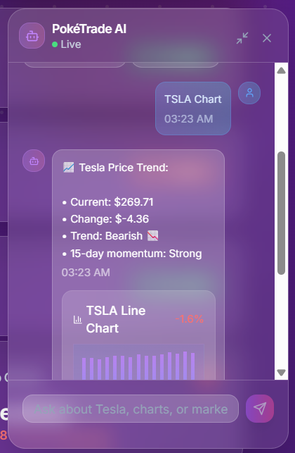
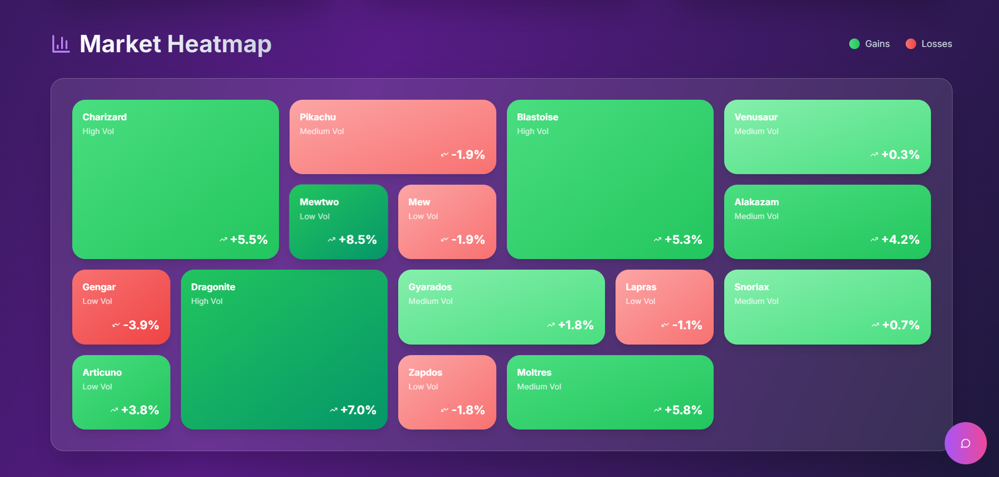
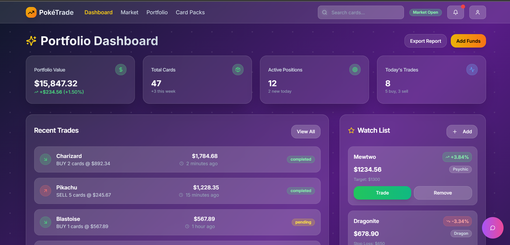
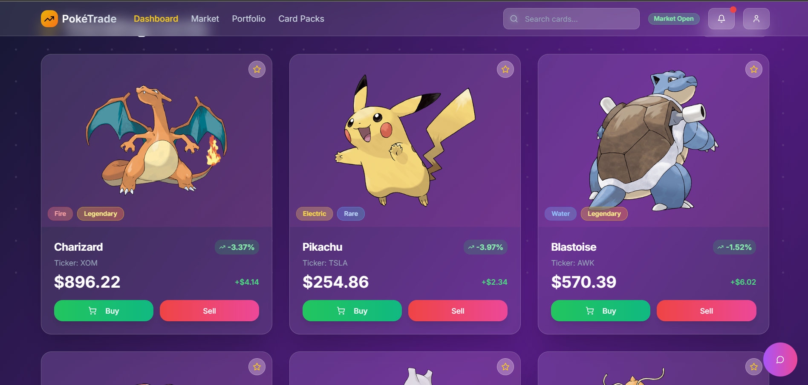

# PokéTrade Market

A dynamic trading-card platform where Pokémon cards track **real-time stock prices** and **AI-powered market analysis**.

---

## ⚡ Quick Glance

|  |  |  |
|---|---|---|
|  |  |  |
|  |  |  |


---

## 🚀 Key Features

- **Live Market Dashboard** – portfolio value, heat-map, trending cards.
- **Card Gallery** – real-time prices, stock ticker links, AI analysis.
- **Instant Trading** – buy / sell / set limit orders & open mystery packs.
- **AI Insights** – daily reports, card recommendations, risk analysis.
- **WebSocket Updates** – prices stream without refreshing.
- **Chatbot Assistant** – LLM-powered help & market explanations.

---

## 🏗️ Tech Stack

| Layer | Tech |
|-------|------|
| Frontend | React (Next.js 13), TypeScript, TailwindCSS |
| Backend  | FastAPI, Python, WebSockets |
| Data     | Firebase / Supabase (auth + DB) |
| Integrations | PokeAPI • Finnhub • yfinance • Gemini • Perplexity |

---

## 🛰️ System Overview

```
Frontend (Next.js) ⇄ Backend (FastAPI) ⇄ External APIs & Database
                 ⇑ WebSocket price stream
```

1. **Frontend** shows cards, portfolio, AI insights & chatbot.
2. **Backend** handles auth, trades, card valuations and pushes live updates.
3. **External APIs** supply Pokémon data, stock/crypto prices & AI analysis.
4. **Database** stores users, cards, trades & leaderboard.

---

## ⚙️ Local Setup

```bash
# 1. Clone & install deps
pnpm install

# 2. Environment variables
cp env.example .env.local
# fill in your API keys

# 3. Run the dev server
pnpm dev
```

The FastAPI backend lives in `backend/` (if included). Start it with:

```bash
uvicorn main:app --reload
```

---

## 🔑 Environment Variables

```
FINNHUB_API_KEY=
GEMINI_API_KEY=
PERPLEXITY_API_KEY=
```

Add more keys as you integrate further APIs.

---

## 🤝 Contributing

1. Fork the project & create a feature branch.
2. Follow the coding style (`pnpm lint`).
3. Open a PR – screenshots/gifs welcome!

---

## 📄 License

MIT 
